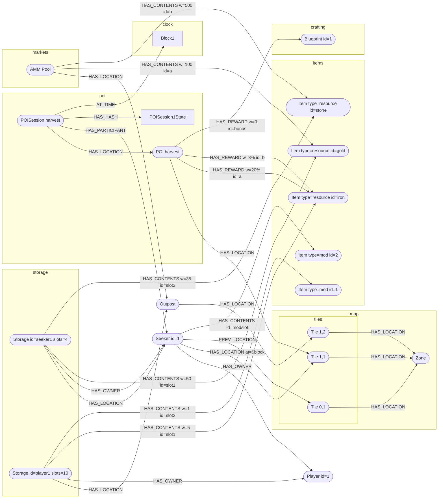

# ds-contracts

## Overview

Dawnseekers contracts.

## Schema

:warning: super rough first pass, and has no relationship to anything in code, just throwing ideas around at this point


## Running the tests

You can run the tests through docker:

```
docker run -v $PWD:/app --platform=linux/amd64 ghcr.io/foundry-rs/foundry:latest "forge test --root /app"
```

append `--watch` to have the tests re-run on change...

```
docker run -v $PWD:/app --platform=linux/amd64 ghcr.io/foundry-rs/foundry:latest "forge test --root /app --watch"
```

or if you have [foundry](https://getfoundry.sh/) locally you should be able to use directly...

```
forge test
```

## Deploying a local dev chain

**If you are working on [ds-unity](https://github.com/playmint/ds-unity), you probably want to use the instructions: [here](https://github.com/playmint/ds-unity)**

If you just want to poke the GraphQL API with these contracts installed, then you can use docker-compose to provision a local chain, cog-services and have the contracts deployed to it:

```
docker-compose up --build
```

The API explorer will be available at http://localhost:3080

The chain RPC endpoint will be available at http://localhost:3045

