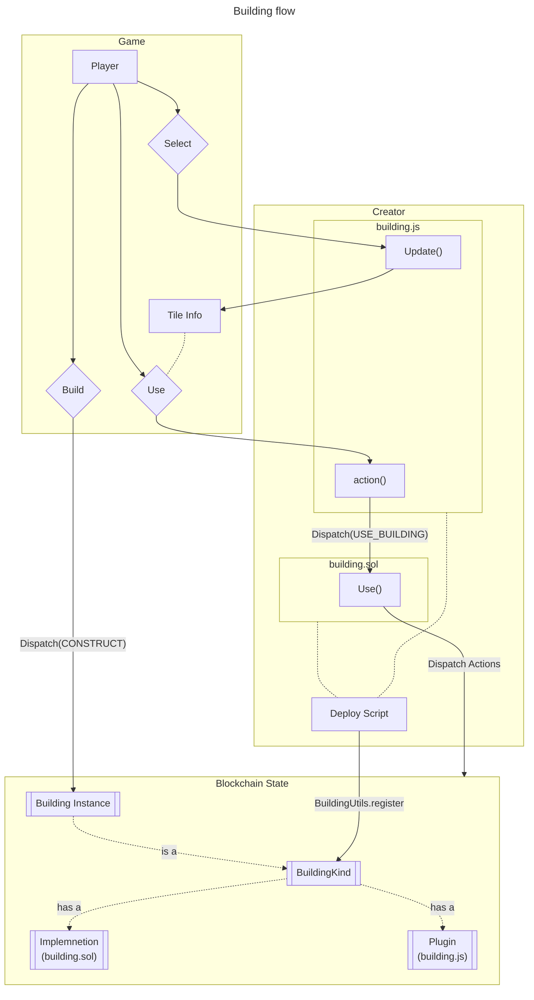

# Code Docs

# Extending Downstream with Buildings

A `BuildingKind` defines a type of building that players can build on the Downstream map. The core game only defines one BuildingKind: the Welcome Hut, which is not enough for anyone to really do anything.

You, the community of Downstream creators must program and deploy more `BuildingKind`s to define what players can build, or put another way, define the game.

## Where to start looking at code

The **[ds-hammer-factory](https://github.com/playmint/ds-hammer-factory)** repository is our example of a new `BuildingKind` that crafts a new kind of item. It has all the code and scripts to deploy it to the game, so start here.

The three files to look at for defining an example building are 

- src/HammerFactory.sol
- src/HammerFactory.js
- script/Deploy.sol

There is a [**walk through**](https://www.notion.so/Developing-a-New-Building-eeb3d01d67834ae6abb1e9e98f5e1322?pvs=21) of modifying a copy of the Hammer Factory to create your first building kind.

If you want to dig into the core game code that you are extending, you’ll find it all in the `contracts/libs/ds`. 

<aside>
ℹ️ Despite the folder name, `contracts/libs/ds` is not *just* contract code. This is a git submodule of the core [ds](https://github.com/playmint/ds) repository, which is all of the source code for Downstream including contracts, services, client, browser frontend and Unity map.

</aside>

## Components of a BuildingKind

### Smart Contract

A smart contract that implements the `BuildingKind` interface is required to perform smart contract actions from your building. 

### Javascript Interface

A javscript file that exports an `Update` function is required to display UI in the frontend and send call into the smart contract.

### Craft Recipe

Buildings can generate up to one kind of game items if they are created with the crafting recipe for that item.

### Registration (Via Deploy script)

A `BuildingKind` node ID must be created and registered with the live Downstream game. This is typically done in a deploy script.

Once the BuildingKind is registered, the smart contract, javascript and any crafting recipe can be associated with it in the same Deploy script.

## BuildingKind Flow

Once you have **registered** a `BuildingKind` , any player can build an instance of that building on the map. 

Once an instance of the building exists on the map, any player can select it, which triggers the **Javascript** **Interface** to display any text, images and buttons in the tile info panel.

If a player has a Seeker next to the building, any buttons that trigger the **smart contract** will become active.

Pressing those buttons will result in the **Use** smart contract function being called.



# Downstream API

<aside>
ℹ️ These code DOCs reference the Downstream API as viewed from the ds-hammer-factory repository. You could also work with the ds repository directly.

</aside>

## Help inspecting the shape of data

### Browser Console

While playing, hit F12 and turn on verbose console logging. Each time you select a building on the map you will get an output of all the state that is being sent to that buildings javascript plugin. Expanding the elements of these data objects is a good way to see what data is available when writing your own plugin.

### GraphQL

/todo

## Solidity Contracts

Found in `contracts/libs/ds/src`, this folder is mapped to import as “@ds” and contact code files in these docs are referenced relative to @ds.

### BuildingKind.Use()

```solidity
function use(Game ds, bytes24 buildingInstanceID, bytes24 seekerID, bytes memory payload)
```

This is the entry point for a buildings smart contract.

It is called from the core game when processing a `USE_BUILDING` Action, which is dispatched from the javascript plugin code for a building.

The `ds` param can be used to interact with Downstream via the Action Dispatch system using the current Downstream session key. 

<aside>
ℹ️ You can also compose with any other solidity code on the same Downstream chain but any transactions outside of Downstream will need the player to sign.

</aside>

If the BuildingKind has been registered with a crafting recipe, the `CRAFT` Action can be dispatched.

`buildingInstanceID` and `seekerID` can be used to access the properties on the building being used and the seeker using it. For example accessing their location or any bags they are holding.

### Building Registration

`@ds/Utils/BuildingUtils.register` is a helper function that handles registering a BuildingKind and all its components. Internally it uses the following actions.

A `BuildingKind` Node needs to be registered with Downstream using the `REGISTER_BUILDING_KIND` Action.

Once registered the following actions can be used to set it up:

- `REGISTER_KIND_IMPLEMENTATION` (Solidity smart contract implementation)
- `REGISTER_KIND_PLUGIN` (The Javascript interface)
- `REGISTER_CRAFT_RECIPE` (Optional Crafting Recipe)

### Schema - Nodes and Relationships

Downstream uses COG and its graph data model with all state being represented as Nodes and Relationships.

**`@ds/schema/schema.sol`** defines all the “kinds” of nodes and types (”rel”) of relationship.

Each node is a 24 byte identifier constructed from its kind plus any parameters packed in.

Each relationship is constructed of two nodes of specific kinds and an optional weight value.

Reading the Schema helps understand the structure of the game data but It’s not necessary to understand the internals of Nodes and Relationships. Instead, modifying state is through Actions and reading state is through provided Utility functions.

<aside>
⚠️ Modifying state is currently unprotected. Any smart contract, including new Building contracts could set any state they want. We ask you not to do this and only modify State through Actions - which will be enforced in a future version.

</aside>

### Action Dispatching

Actions are the API to change Downstream state, or put another way, they are used to play the game. Your new Building code can use any Action to change the state of world, as long the action conditions are met.

They are special function signatures including an identifier and set of parameters that can be dispatched via `Game.getDispatcher().dispatch()` and result in an on-chain transaction.

`**@ds/actions/Actions.sol**` defines all the available actions.

The various `Reduce` functions in the `Rule` contracts in **`@ds/rules`** implement the Actions and are where you can see all the restrictions implemented through require calls.

When calling dispatch() the action must be abi encoded with the function signature and relevant parameter values. See examples in @ds/script/deploy.sol for how these are constructed. The intention is to abstract all the common actions away in utility functions like `BuildingUtils.register()` in `**@ds/utils/BuildingUtils.sol**`.

### Downstream Data Model

The data model is written to be as flexible as possible. For example, any node can have the Implementation relationship with a smart contract address. This is used for a common purpose, e.g. BuildingKinds being assigned a solidity implementation by a Mod, but could be used to associate smart contracts with any node.

This list describes, at a slightly higher level than the graph, what the core Downstream data models are. 

- **A** **`Building`** (constructed by players on the map)
    - Has a `Location`
    - Has a `BuildingKind`.
    - Can have multiple `Bags` in `EquipSlots` .
- **A** **`BuildingKind`** (programmed and deployed by modders/builders)
    - Can have a crafting recipe (see `REGISTER_CRAFT_RECIPE`)
        - Including up to `Input` Item-quantities and 1 `Output` item-quantity.
    - Can have a smart contract `implementation`.
    - Can have a javascript plugin implementation (`annotation`)
- **An** **`Item`** (Found in Bags on the map or crafted by Buildings)
    - Has a quantity of each of the 3 `Atom` types.
        - The 3 default Items found in Bags on the map are `Bouba`, `Kiki` and `Semiote` and they all consist of just one Atom type.
    - Is either `stackable` or not (and therefore equipable).
    - Has a name.
    - Has an icon ID.
- **An** **`Atom`** (what make up items)
    - Can be `Defense`, `Attack` or `Life`
- **A** **`Bag`** (Engineers start with two, more appear on the map and magically, tiles and buildings create invisible ones when transferred items)
    - Has 4 Item Slots
    - Each slot can have one equip-able Item or up to 100 stackable Items.
- **An Engineer**  (**`Seeker`**  in code) (one spawned for each wallet)
    - Has a location.
    - Has two `Bag` slots.

## Javascript Plugin

Javascript code must be attached to a BuildingKind in order to control what is displayed when selecting the building, and provide controls to trigger the actions that are available when using the building.

The javascript must implement an Update function, which takes a State parameter and returns a description of the UI to display. 

Any buttons, that trigger functions defined in the same javascript code, can be included as part of the UI.

### Input

The Update function is passed a parameter of type GameState. This object has three top level sub objects: `Player`, `World` and `Selection`.

****************Player**************** contains data about the player associated with the current session, including wallet address and seekers they own.

************World************ contains summary information about everything in the Downstream world including ids for constructed buildings and discovered tiles. Not all of the world state is available but all state related to currently selected tiles is available from the Selection object.

********************Selection******************** contains all state related to the currently selected Seeker, currently selected tile(s) and the intent (one of the Select, Construct, Scout, Move and Use modes) of the player.

These states are constructed from the [graphql API](https://www.notion.so/Code-Docs-7e6c8e839ec141e3b88c16a3b36bfb79?pvs=21) and can be conveniently [explored in the browser debug console](https://www.notion.so/Code-Docs-7e6c8e839ec141e3b88c16a3b36bfb79?pvs=21).

### Output

The Update function must return an object that controls what is displayed in the game UI for the building.

For reference, the code that parses this output is in `lib/ds/core/src/api/v1.ts`.

For an example output see the return statement of `src/HammerFactory.js`.

```jsx
// Currently unused
version: 1,

// List of screen area UI compoments to render.
// Currently only 1 component, of type 'buiding' is used.
components: [
{  
	//
	// diaplayed whenever building tile is selected in either Select ot Use mode
	//

		// Currently unused.
		version: 1,

		// Currently only 'building' is available.
		type: 'building',

		// Required but unused so anything will do.
		id: 'my-building',

		// Large title text.
		// Could be fixed or dynamic based on state. 
		title: 'Title text',

		// Smaller desription text. 
		// Could be fixed or dynamic based on state.
		summary: 'Smaller text',
	                       

	//  
	// diaplayed whenever building tile is selected in Use mode only
	//    

	// List of content to dispaly.
	// Only 1 element is displayed at a time. 
	// Element with id 'default' is initialy displayed.
	// Toggle buttons can show an element with a different id.
	content: [
	{
		//
		// Content example 1, default, using a toggle button and html form input
		//

		// At least one element must have id 'default'.
		// Other ids can be triggered with toggle buttons.
		id: 'default',  

		// Must be one of 'inline', 'popout' or 'dialog'.
		// Currently they all behave the same.
		type: 'inline', 

		// A string of HTML rendered inside a Form element.
		// This is passed though DOMPurify.santize before being rendered.
		// Tags that are stripped is teh default set here:
		// https://github.com/cure53/DOMPurify/wiki/Default-TAGs-ATTRIBUTEs-allow-list-&-blocklist#default-allow-listsblocklists
		html:           
			`<b>
				<input type="submit" value="Check in">
			</b>`,       

		// function, in this javascript file
		// called for any input of type 'submit' in the html above        
		submit:             
			() => {ds.log("checked in");},

		// list of buttons
		buttons: [
		{ 
			// Text shown on button 
			text: 'Next',

			// either 'action' or 'toggle'
			type: 'toggle',

			// id of content to switch to ('toggle' type only)
			content: 'sayhi',

			// is button disabled - can set this based on State
			disabled: false     
		},],
	},
	{
		//
		// Content example 2, sayhi, using an action button
		//

		id: 'sayhi',                
		type: 'inline',
		
		// list of buttons
		buttons: [
		{ 
			text: 'Say Hi',           
			type: 'action',
			// function, in this javascript file, called
			// when button is pressed ('action' type only)
			action:
				() => {ds.log("hi");},  
		},],
	},], // end of content list
},] // end of component list (currently always just 1)
```

### Available Downstream Commands

Any functions defined in your plugin and called from either an action button or an html form submission can makes use of special Downstream functions that have been explicitly exposed.

These are available via importing the `ds` object at the top of the plugin javascript file,

Currently `dispatch`, `encodeCall` and `log` are provided.

The source code that exposes these functions can be found `lib/ds/core/src/plugins.ts`, `loadPlugin().`

The dispatch function is how plugins can send solidity transactions to the Downstream game on-chain. See the [Action Dispatching](https://www.notion.so/Code-Docs-7e6c8e839ec141e3b88c16a3b36bfb79?pvs=21) section above.

```jsx
import ds from 'dawnseekers';

// Dispatch an action to the Downstream game on the blockchain.
// These use the current session for the current player.
// Typically you will want to call your building's solidity use() function,
// which is done by dispatching the BUILDING_USE action.
ds.dispatch(
      {
          name: 'BUILDING_USE',
          args: [selected.tiles[0].building.id, selected.seeker.id, []]
      },
  );

// render a text message to the log area of the game's UI
ds.log("Called my building's use() function in the BuildingKind contract");

// todo - example of encodeCall
ds.encodeCall();
```

### Default Crafting Behaviour

If your building kind defines Inputs and an Output, then the UI will show appropriate item slots as part of you plugin UI by default.


There is no need for plugin code to handle these inputs, however it is up to you to call dispatch the CRAFT action, either via the solidity use() function for via dispatching the action directly from the javascript.
