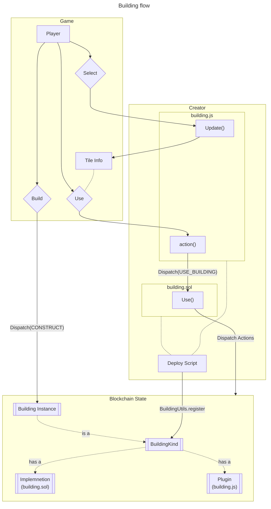

# Extending Downstream with Buildings

A `BuildingKind` defines a type of building that players can build on the Downstream map. The core game only defines one BuildingKind: the Welcome Hut, which is not enough for anyone to really do anything.

You, the community of Downstream creators must program and deploy more `BuildingKind`s to define what players can build, or put another way, define the game.

## Where to start looking at code

The **[ds-hammer-factory](https://github.com/playmint/ds-hammer-factory)** repository is our example of a new `BuildingKind` that crafts a new kind of item. It has all the code and scripts to deploy it to the game, so start here.

The three files to look at for defining an example building are 

- src/HammerFactory.sol
- src/HammerFactory.js
- script/Deploy.sol

There is a [**walk through**](https://www.notion.so/Developing-a-New-Building-eeb3d01d67834ae6abb1e9e98f5e1322?pvs=21) of modifying a copy of the Hammer Factory to create your first building kind.

If you want to dig into the core game code that you are extending, you’ll find it all in the `contracts/libs/ds`. 

> ℹ️ Despite the folder name, `contracts/libs/ds` is not *just* contract code. This is a git submodule of the core [ds](https://github.com/playmint/ds) repository, which is all of the source code for Downstream including contracts, services, client, browser frontend and Unity map.

## Components of a BuildingKind

### Smart Contract

A smart contract that implements the `BuildingKind` interface is required to perform smart contract actions from your building. 

### Javascript Interface

A javscript file that exports an `Update` function is required to display UI in the frontend and send call into the smart contract.

### Craft Recipe

Buildings can generate up to one kind of game items if they are created with the crafting recipe for that item.

### Registration (Via Deploy script)

A `BuildingKind` node ID must be created and registered with the live Downstream game. This is typically done in a deploy script.

Once the BuildingKind is registered, the smart contract, javascript and any crafting recipe can be associated with it in the same Deploy script.

## BuildingKind Flow

Once you have **registered** a `BuildingKind` , any player can build an instance of that building on the map. 

Once an instance of the building exists on the map, any player can select it, which triggers the **Javascript** **Interface** to display any text, images and buttons in the tile info panel.

If a player has a Seeker next to the building, any buttons that trigger the **smart contract** will become active.

Pressing those buttons will result in the **Use** smart contract function being called.

